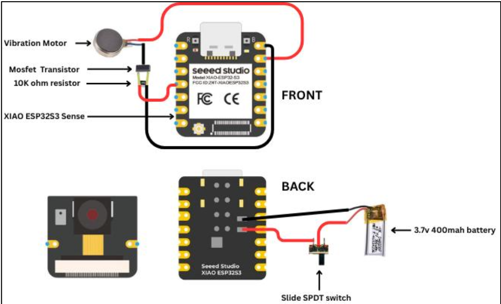
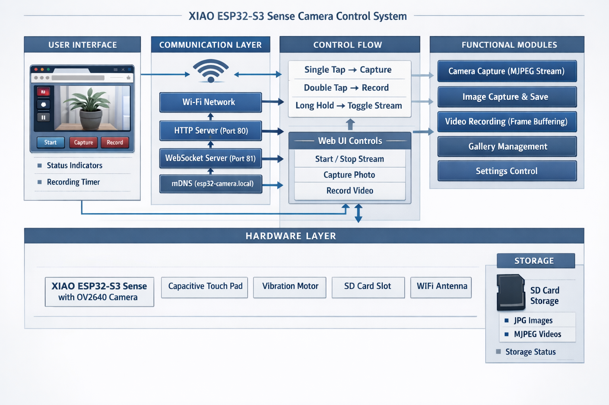

# PixelPendant - XIAO ESP32-S3 Sense based Wearable Camera Control System

A high-performance firmware for the Seeed XIAO ESP32-S3 Sense microcontroller enabling real-time camera streaming, image capture, and video recording with web-based control.

## Features

✅ **Live MJPEG Streaming** - Real-time video feed at 25 FPS  
✅ **Image Capture** - Single-frame capture with automatic timestamping  
✅ **Video Recording** - MJPEG video recording to SD card  
✅ **Web UI Control** - Responsive browser interface  
✅ **WebSocket Communication** - Real-time button control  
✅ **Touch Sensor Control** - Physical touch input for stream, capture, and recording  
✅ **Haptic Feedback** - Vibration motor response for user actions  
✅ **Gallery View** - Browse captured images and videos  
✅ **WiFi Connectivity** - Secure network access with auto-reconnect  
✅ **Time Sync** - NTP synchronization for accurate timestamps  
✅ **Optimized Performance** - Fast startup and smooth operation 

## 🖼️ Circuit Schematic



---

## 🔄 System Flowchart



---

## Hardware Requirements

### Microcontroller
- **Seeed XIAO ESP32-S3 Sense** (with integrated OV2640 camera)
  - Dual-core processor (240 MHz each)
  - WiFi 6E connectivity
  - 8 MB PSRAM
  - USB-C programming

### External Components
- **SD Card Module** - For video/image storage
  - Supports microSD cards (32GB tested)
  - SPI interface (CS on GPIO 21)

- **Vibration Motor** - Haptic feedback
  - GPIO 4 (PWM control)
  - 3.3V compatible

- **Touch Sensor** - Physical control input
  - GPIO 2 (capacitive touch)
  - Long-hold for stream toggle (3 seconds)
  - Single-tap for photo capture
  - Double-tap for video recording

### Wiring Diagram

| Component | ESP32-S3 Pin | Notes |
|-----------|-------------|-------|
| SD Card CS | GPIO 21 | SPI chip select |
| SD Card MOSI | GPIO 11 | SPI MOSI |
| SD Card MISO | GPIO 13 | SPI MISO |
| SD Card CLK | GPIO 9 | SPI clock |
| Vibration Motor | GPIO 4 | PWM output (3.3V) |
| Touch Sensor | GPIO 2 | Capacitive input |

## Pin Configuration

```cpp
// Camera (OV2640)
XCLK: GPIO 10       | SIOD: GPIO 40       | SIOC: GPIO 39
D0-D7: GPIO 46,3,8,18,17,16,15,7

// SD Card
CS: GPIO 21         | MOSI: GPIO 11       | MISO: GPIO 13
CLK: GPIO 9

// I/O
Vibration Motor: GPIO 4
Touch Sensor: GPIO 2
```

## Installation

### 1. Arduino IDE Setup
- Install [Arduino IDE 2.0+](https://www.arduino.cc/en/software)
- Add ESP32 board manager: `https://raw.githubusercontent.com/espressif/arduino-esp32/gh-pages/package_esp32_index.json`
- Select board: **XIAO_ESP32S3**
- Set Flash Size: **8MB**

### 2. Required Libraries
Install via Arduino Library Manager:
- **WebSocketsServer** by Markus Sattler
- **ArduinoJson** by Benoit Blanchon
- **esp_camera** (built-in with ESP32 core)

### 3. Create secrets.h
Create a `secrets.h` file in the sketch directory:

```cpp
#ifndef SECRETS_H
#define SECRETS_H

#define WIFI_SSID "your_network_name"
#define WIFI_PASSWORD "your_network_password"

#endif
```

### 4. Upload Firmware
- Connect XIAO ESP32-S3 via USB-C
- Select correct COM port
- Click **Upload**
- Wait for "Hard resetting via RTS pin..." message

## Usage

### Web Interface Access
1. Open Serial Monitor (115200 baud) to see device info
2. Connect to WiFi: `esp32-camera.local` or use printed IP address
3. Open browser: `http://esp32-camera.local`

### Web Controls
- **START/STOP STREAM** - Toggle live video feed
- **CAPTURE IMAGE** - Save current frame to SD card
- **START/STOP RECORDING** - Record video to SD card
- **GALLERY** - Browse saved images and videos
- **DELETE** - Remove individual files or all files

### Touch Sensor Controls
| Action | Duration | Result |
|--------|----------|--------|
| **Long Hold** | 3 seconds | Toggle live stream ON/OFF |
| **Single Tap** | < 400ms | Capture photo |
| **Double Tap** | 2× within 400ms | Toggle video recording |

**Haptic Feedback:**
- Single pulse: Photo capture confirmation
- Double pulse: Stream toggle
- Triple pulse: Recording start
- Long pulse: Recording stop

## Performance Specifications

| Metric | Value |
|--------|-------|
| Startup Time | ~4-5 seconds |
| WiFi Connection | 8 seconds (optimized) |
| Stream FPS | 25 FPS (QVGA) |
| Stream Latency | ~100ms |
| Photo Capture | 200ms camera stabilization |
| Recording FPS | 25 FPS |
| Buffer Flush | 20ms |
| Touch Response | <50ms |

## Camera Settings

**Default Configuration:**
- Resolution: QVGA (176×144)
- Format: MJPEG
- JPEG Quality: 15 (high compression, lower value = higher compression)
- Frame Rate: 25 FPS
- Contrast: 0
- Brightness: 0
- Saturation: 0

**Adjustable via Web API:**
- Brightness, contrast, saturation
- Horizontal/vertical mirror
- Color mode (RGB/BW)

## File Structure

```
camera_control_system/
├── camera_control_system.ino    # Main firmware
├── secrets.h                    # WiFi credentials (create this)
└── README.md                    # This file
```

## API Endpoints

### HTTP Endpoints

| Endpoint | Method | Purpose |
|----------|--------|---------|
| `/` | GET | HTML web interface |
| `/stream` | GET | MJPEG video stream |
| `/capture` | POST | Capture single image |
| `/image` | GET | Get captured image |
| `/gallery` | GET | List images/videos |
| `/galleryImage` | GET | Download gallery item |
| `/playVideo` | GET | Stream video file |
| `/deleteImage` | POST | Delete file |
| `/deleteAll` | POST | Delete all files |

### WebSocket Messages

**Client → Device:**
```json
{"action":"stream_toggle"}
{"action":"capture"}
{"action":"recording_toggle"}
```

**Device → Client:**
```json
{"action":"stream_toggle","state":"started"}
{"action":"image_captured"}
{"action":"recording_status","status":"started"}
```

## Serial Debug Output

The device outputs diagnostic information at 115200 baud:

```
[INIT] XIAO ESP32-S3 Sense - Camera Control
[WIFI] Connecting to network...
[WIFI] Connected! IP: 192.168.1.100
[OK] HTTP server started on port 80
[OK] WebSocket server started on port 81
[TOUCH] Single Tap -> Capturing Photo
[REC] Started: 2026-02-03_14-30-45.mjpeg
```

## Troubleshooting

### Issue: Won't connect to WiFi
- Verify SSID and password in `secrets.h`
- Check WiFi signal strength
- Restart device or WiFi router

### Issue: No stream video
- Ensure SD card is detected
- Check camera orientation (rotate if needed)
- Monitor Serial output for errors

### Issue: SD card not recognized
- Format SD card as FAT32
- Verify SPI wiring (CLK, MOSI, MISO, CS)
- Check card is inserted properly

### Issue: Touch sensor not responding
- Clean the touch surface
- Verify GPIO 2 is connected properly
- Check Serial output for touch values (should spike on contact)

### Issue: Slow performance
- Reduce MJPEG quality setting
- Decrease polling frequency for gallery
- Use 2.4GHz WiFi (not 5GHz)

## Serial Debugging Commands

Monitor Serial output at **115200 baud** for real-time status:
- `[WIFI]` - WiFi connection events
- `[TOUCH]` - Touch sensor input
- `[REC]` - Recording status
- `[TASK]` - Recording task frames captured
- `[OK]` - Successful initialization
- `[ERROR]` - Error messages

## Memory Usage

- **SRAM**: ~150KB (WiFi/WebSocket buffers)
- **PSRAM**: ~4MB (dual frame buffers for camera)
- **Flash**: ~500KB (firmware)

## Power Consumption

| State | Current |
|-------|---------|
| Idle (WiFi connected) | ~80mA |
| Streaming | ~150mA |
| Recording | ~180mA |
| USB powered | 500mA max |

## Optimization Features

1. **Dual-Core Architecture** - Recording on Core 1, main tasks on Core 0
2. **Lazy Image Loading** - Gallery uses Intersection Observer for efficient loading
3. **Frame Skipping** - Drops frames if stream can't keep up with FPS target
4. **Buffer Management** - Dual frame buffers prevent stale captures
5. **Async NTP** - Non-blocking time synchronization

## Technical Stack

- **Microcontroller**: ESP32-S3 (Xtensa dual-core)
- **Camera Driver**: ESP Camera library
- **Connectivity**: WiFi 6E with mDNS
- **Web Server**: ESP32 built-in HTTP server
- **WebSocket**: WebSocketsServer library
- **JSON**: ArduinoJson library
- **Storage**: SPIFFS (SD card via SPI)

## License

This project is part of AEONIX SPARKLERS camera system.

## Support

For issues, questions, or contributions, refer to the project documentation or hardware datasheet:
- [Seeed XIAO ESP32-S3 Sense Wiki](https://wiki.seeedstudio.com/xiao_esp32s3_sense/)
- [OV2640 Camera Datasheet](https://www.ovt.com/)
- [ESP32-S3 Technical Reference](https://www.espressif.com/)

---

**Version**: 2.0  
**Last Updated**: February 2026  
**Status**: Production Ready ✅
